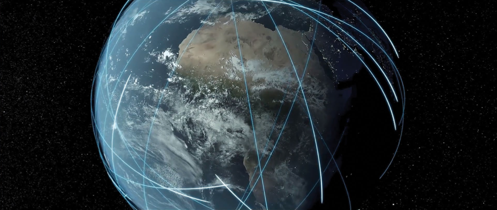

# ICEYE SAR PRODUCTS

## WELCOME TO ICEYE
### Your Choice for Persistent Monitoring

ICEYE empowers commercial and government partners with unmatched persistent monitoring capabilities for any location on Earth. We do this with our continually growing SAR satellite constellation, currently in orbit and delivering SAR data. This product guide reviews our constellation, products, imaging modes and ordering process.

This is a living document because our innovative small SARs are flexible and they welcome our routine upgrades to their resolution, coverage and quality. We’ll release new versions of this guide as we improve our sensors, expand our constellation, and streamline our order and delivery systems.

SAR sensors see through clouds and darkness. They measure pulse echoes with a precision much smaller than a single wavelength. Their resolution is independent of distance. They are capable of pristine geolocation, and they are change detection machines.

*We Look Forward to Serving You*

### The Small SAR Revolution in Earth Imaging

During the Middle Ages, if you wanted to understand the way the world worked you would consult your local religious leader. A Priest or Prophet would interpret the Word of God from beautifully written tomes that were transcribed by hand over many years. These books were ornate and so precious that they could not be widely distributed, and most people did not know how to read. In these years, the thoughts of nations were controlled by various religious and political leaders.

Then everything changed. The Renaissance and Reformation spurred new ways of thinking, and their ideas were recorded in printed books that were produced at low cost and in great volumes. People learned to read for themselves and think for themselves. Information spread across the globe.

*Sometimes disruption can be good. :smile:*

Hundreds of years later, in 2012, a small team of students working in the Nanosatellite Group of Aalto University considered the sequestered world of earth observation. The team was bothered by the limitations of government satellite programs in the same way that Renaissance and Reformation advocates challenged the knowledge control of the Middle Ages.

Satellite imagery has been mostly provided by massive, government-owned or government-sponsored, exquisite systems. Like the tomes of old, these are beautifully implemented and precious. But normal people rarely have access to their images, and even when they are available, they do not have the timeliness to support the quick decisions needed in this rapidly changing world. 

The Nanosatellite students thought that timely, always available fine-resolution imagery should become a part of everyday life in the 21st century in the same way that GPS became integrated to nearly all businesses in the last decade of the 20th century. The humanitarian applications of easily-accessible imagery would include earthquakes, floods, volcanoes, glacial flow, and numerous environmental indicators. But if earth-observation imagery were to become as available, reliable and timely as the pace of our modern lives requires, things needed to change.

Fueled by curiosity, passion, and long, dark Helsinki nights, the students decided that Synthetic Aperture Radar (SAR) would be the most useful way to obtain guaranteed, all-weather, day-night, observations of this cloud-covered planet. They reconsidered the conventional thinking regarding the mass and size needed to build SAR satellites, and then developed experimental sensors to prove and revise their thinking.

In 2015 ICEYE Oy was born. And thanks to several backers who shared our vision, on January 12th, 2018 the world’s first micro-SAR satellite was launched. In contrast to the existing SAR systems that each weigh several tons, our  ICEYE-X1 weighed only 75kg. It provided beautiful 3-meter resolution imagery, and it allowed our company to evaluate many natural disasters.

The ICEYE fleet is now growing rapidly. We began 2021 with 7 satellites, and we’ll expand this to a constellation of 18 by mid-2022. Change is natural to our flexible systems. We upgrade our satellites the way programmers update code. Our resolution and coverage improves with each new version. And our low-cost, low-mass satellites are so highly maneuverable that we can reposition them to optimize revisit rates and support global change detection.

We will bring our users access to highly accurate, highly reliable monitoring, whenever and wherever they need it, at a pace that has never before existed.

**Welcome to the Earth Observation Renaissance !**

* :fontawesome-brands-medium:{ .medium } – Medium
* :fontawesome-brands-twitter:{ .twitter } – Twitter
* :fontawesome-brands-facebook:{ .facebook } – Facebook
* :fontawesome-brands-linkedin:{ .facebook } – LinkedIn
* :octicons-heart-fill-24:{ .heart }

