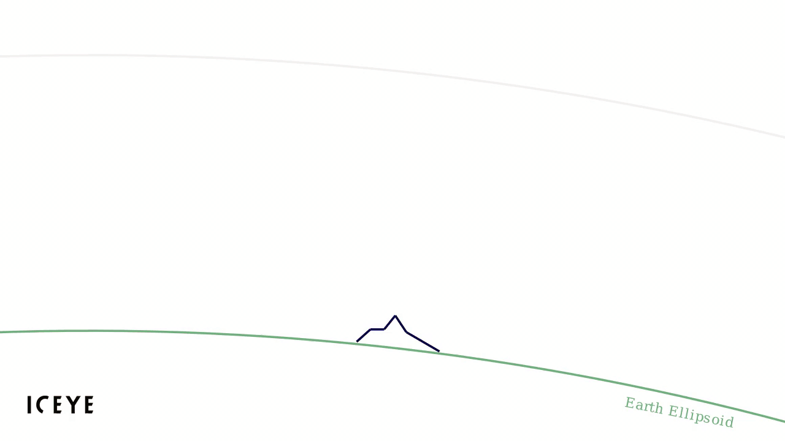
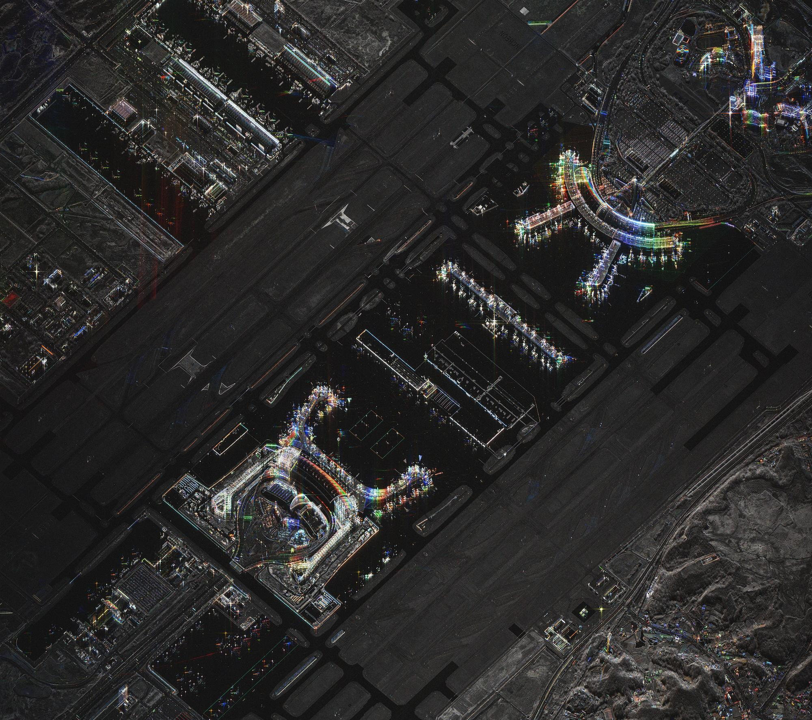

!!! info 
    Colorized Sub-aperture Images are only produced when the Dwell collection mode is utilized

## Colorized Sub-aperture Image (CSI)

 Colorized Sub-aperture Images are made by coloring the backscatter received for different sub-apertures and combining it into a single product. The colors denote the direction that a point in the image predominantly scatters in. The collection time is split into individual sub-apertures. Each sub-aperture is individually colored from red at the start of the collection to blue at the end of the collection. A composite image is made by combining all the sub-apertures and it can be interpreted as follows:

* **Isotropic scatterers:** Objects on the ground that scatter an equal amount in all directions have an equal brightness in all directions that they are looked at. When the individually colored sub-apertures from these areas are added together, each individual color contribution is roughly the same making **their appearance in the CSI image a grey-scale** - like a normal SAR image. Examples of isotropic scatters are **grass, trees and water.**
* **Anisotropic scatterers:** Objects that have a dominant reflection in one particular direction **will retain that color** after all the sub-apertures are combined. Objects that have preferential scattering orientations usually have **flat surfaces and/or sharp angles and indicate that they are human-made**. Objects that are **partially obstructed by vegetation or tree canopy** will also be highlighted in a **dominant color**. As the human eye is very good at picking out colors from grey tones, our eyes are naturally drawn to the human-made features.

<figure markdown>
{width="800"}
<figcaption align = "center"><em>Figure 1: Detail of a Colorized Sub-aperture Image (CSI) showing vehicles and human made infrastructure displayed in a dominant color. </em></figcaption>
</figure> 

 ICEYE is able to produce Colorized Sub-aperture Images (CSI) only for certain types of collection characteristics such as Dwell. In the case of Dwell, each CSI is made up of 13 sub-apertures, each containing the data acquired during less than 2 seconds. The total duration of a Dwell acquisition is 25 seconds. The exact time, duration, color and satellite location for each sub-aperture is available as  [metadata in the GeoTIFF product file](#container-format-and-metadata). 

<figure markdown>
{width="800"}
<figcaption align = "center"><em>Figure 2: Detail of a Dwell acquisition and how each color is assigned when forming a Colorized Sub-aperture Image (CSI). </em></figcaption>
</figure> 

## Dwell sub-apertures and colors

The nominal duration and color for each sub-aperture in a Dwell collection is documented in the table below. Please see [Notes and Explanations](#notes-and-explanations) for more detailed information as well as corresponding values in the [image metadata](#key-csi-geotiff-metadata). 

<figure markdown>
| Sub-aperture |	Nominal Duration [sec] 	|Color (RGB 0-1)	|Color|
|----|---------|-------|-----|
|1	| 1.91 |	1.0000, 0.0000, 0.0000	|
&#9608;&#9608;
|
|2	| 1.91 |	0.9994, 0.0333, 0.0000	|
&#9608;&#9608;
|
|3	| 1.91 |	0.9864, 0.1644, 0.0000	|
&#9608;&#9608;
|
|4	| 1.91 |	0.9864, 0.1644, 0.0000	|
&#9608;&#9608;
|
|5	| 1.91 |	0.9864, 0.1644, 0.0000	|
&#9608;&#9608;
|
|6	| 1.91 |	0.9864, 0.1644, 0.0000	|
&#9608;&#9608;
|
|7	| 1.91 |	0.9864, 0.1644, 0.0000	|
&#9608;&#9608;
|
|8	| 1.91 |	0.9864, 0.1644, 0.0000	|
&#9608;&#9608;
|
|9	| 1.91 |	0.9864, 0.1644, 0.0000	|
&#9608;&#9608;
|
|10	| 1.91 |	0.9864, 0.1644, 0.0000	|
&#9608;&#9608;
|
|11	| 1.91 |	0.9864, 0.1644, 0.0000	|
&#9608;&#9608;
|
|12	| 1.91 |	0.9864, 0.1644, 0.0000	|
&#9608;&#9608;
|
|13	| 1.91 |	0.9864, 0.1644, 0.0000	|
&#9608;&#9608;
|
</figure>

<figure markdown>
{width="800"}
<figcaption align = "center"><em>Figure 3: Example of a concentration of vehicles and equipment highlighted in a Colorized Sub-aperture Image (CSI)</em></figcaption>
</figure> 

## Container format and metadata

The CSI format uses a regular GeoTIFF container so the image can be viewed by any regular (or geospatial) image viewer. Important metadata on each of each of the sub-apertures and how the CSI is formed is available in the GeoTIFF. GeoTIFF metadata can be accessed by multiple methods including:

* Using the gdal library and running the command <code>gdalinfo filename.tif</code> (for example: <code>gdalinfo ICEYE_X2_VID_SLED_1906432_20231020T110813.tif</code>)  
* Using the open source application QGIS and selecting Raster → Miscellaneous → Raster information → Run 

<figure markdown>
## Key CSI GeoTIFF Metadata 
| Metadata Element&nbsp;&nbsp;&nbsp;&nbsp;&nbsp;&nbsp;&nbsp;| Description| Type| Unit|
|----|----|----|----|
|`FRAME_COLOURS`|RGB 0-1 color code of each sub-aperture. |List of float64 triplets|RGB 0-1|
|`FRAME_DURATION`|Duration of SAR data collection for each sub-aperture. |List of float64|seconds|
|`FRAME_MID_TIME`|Timestamp at the center of each sub-aperture. Number of seconds since the beginning of the SAR collection. |List of float64|seconds|
|`FRAME_POS`|Satellite position at the center of each sub-aperture|List of float64 triplets|ECEF coordinates|
|`FRAME_VEL`|Velocity vector of the satellite at the center of each sub-aperture |List of float64 triplets|meters per second|
</figure>

<figure markdown>
{width="800"}
<figcaption align = "center"><em>Figure 4: Example of Colorized Sub-aperture Image (CSI) of an airport highlighting human-made structures and equipment in dominant colors</em></figcaption>
</figure> 

## Notes and Explanations
1. **Sub-aperture duration:** The duration of the sub-aperture varies slightly depending on specific collection characteristics. The actual duration value is available in the [GeoTIFF metadata](#key-csi-geotiff-metadata).
2. **Sub-aperture colors:**  Nominal colors for each sub-aperture are listed in the metadata table  to facilitate interpretation. The normalized RGB color contribution of each sub-aperture is available in the GeoTIFF metadata element FRAME_COLOURS.