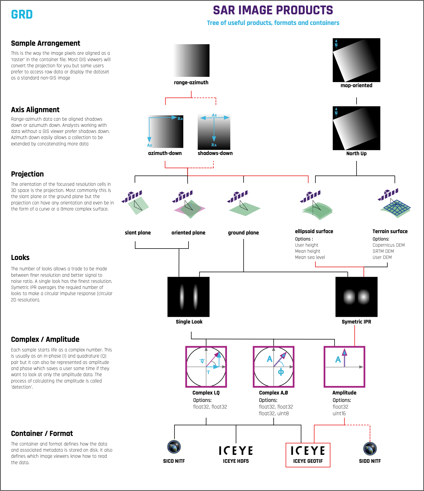

## 'Ground Range Detected' - 😵‍💫?

After complex images are processed into amplitude images and projected to the ground plane they retain the native range-azimuth sensor orientation. The commonly used terms for these range-azimuth amplitude images include some combination of '*detected*', '*ground range*' and '*multi-look*'. At ICEYE these have been called Ground Range Detected (**GRD**) images. While our term is consistent with industry practice, over time we have come to realise that '*GRD*' does not adequately describe the product. In fact, few users understand what '*detected*' really means. It is actually an old electronic engineering term from the days when signal processing was performed on oscilloscopes. When applied to SAR images, detection is the process of converting in-phase and quadrature complex pixels (equivalent to amplitude and phase) into amplitude-only values. Due to SAR’s electrical engineering heritage, technical jargon like this has become infused into the language of SAR, and this confuses users. In this case, we form a simple amplitude image, and refer to it with an obscure engineering term.

Another limitation is that '*ground range*' and '*detected*' do not describe the essential fact that the image is in the  range-azimuth layout. In fact, an alternate form of amplitude images is to interpolate pixels to fit a map projection. While that format is completely different from the native range-azimuth structure, it is also *detected* and it is in the ground range. So, the SAR community’s commonly used terms for range-azimuth amplitude images are based on dated jargon and they fail to state what the structure actually is.

At ICEYE we like to use clear, descriptive English so we prefer to call a GRD image a range-azimuth amplitude image. It might also be called a sensor-orientation amplitude image. It is a struggle, though,  to shake off the SAR community’s legacy language. Many of our customers are used to the term GRD and we are keeping the acronym in some of our product filenames for compatibility reasons. This is likely to change in the future.


## Amplitude Image Description
Amplitude images represent focused SAR data that has been detected and (usually) multi-look processed and projected to the ground plane using an Earth ellipsoid model. The image coordinates are oriented along the flight direction and ground range (figure 1). The pixel spacing is equidistant in azimuth and in ground range. Ground range coordinates are the slant range coordinates projected onto the ellipsoid of the Earth. For this projection the WGS84 reference ellipsoid (table 1) is used and an averaged fixed value of terrain height is used. This makes the ellipsoid surface closer to the true ground surface. The mean ellipsoid height used is annotated in the `avg_scene_height` metadata element.

!!! Tip
    For an explanation of why see [Terrain Height](../geospatialAccuracy#terrain-height) in the 'Geospatial Accuracy' section under 'Foundations'.


<figure markdown>
|ELLIPSOID REFERENCE | SEMI MAJOR AXIS | SEMI MINOR AXIS | INVERSE FLATTENING |
|--------------------|----------------|------------------|--------------------|
|WGS84               | 6378137.0 m    | 6356752.314245 m | 298.257 223 563    |
<figcaption align = "center"><em>Table 1 : WGS84 Reference Ellipsoid used in ICEYE Amplitude images</em></figcaption>
</figure>


Pixel values represent a scaled amplitude. The resulting product has approximately circular spatial resolution and square pixel spacing. Additionally, an incidence angle dependence in range, calculated using the ellipsoidal Earth model has been applied to enable the conversion of radar brightness to backscatter intensity. This is explained in more detail in the section on [Radiometric Considerations](../radiometric#calibration-correction).

The core advantages of range-azimuth amplitude (GRD) images is that they are laid out in the natural SAR orientation, which is required for rigorous geolocation, and their pixels are free of the interpolation artifacts of map projection images.  This product is the form of a SAR amplitude image that retains its SAR heritage. It’s pixels are presented in the natural range-azimuth form best suited for shadows-down interpretation, that is free of map-projection-induced artifacts, that supports manipulation into orthophotos and other forms, and which supports the SAR image geometry model used to calculate ground locations. 

To assist users that require geocoded imagery with minimal interpolation artefacts, ICEYE amplitude image products are tagged with ground control points (GCP) and rapid positioning capability polynomial coefficients (RPC’s). These allow precise geospatial exploitation using freely available tools such as QGIS[@qgis] or GDAL[@gdal].

<figure>

<figcaption align = "center"><em>Figure 1: The Binary Representation of Amplitude Images</em></figcaption>
</figure>

## Binary Representation

The 'digital numbers' in the image data layer $DN_{GRD}$ of amplitude SAR products are stored in a GeoTIFF file format using unsigned 16 bit integer representation along with a combination of commonly used and specifically defined GeoTIFF tags. GeoTiff files are readable with standard image processing and GIS software tools.

It is common for different imaging modes and different incidence angles to have a native range-azimuth sample spacing in the slant plane that is not square. Square sample spacing and a circular impulse response function in the ground plane is achieved either by varying the transmitted bandwidth or by applying multi-looking during the slant to ground transformation and detection process. 

Typically, the conversion from complex samples to amplitude only samples is performed as

$$
|DN_{SLC}|^2 = (I^2 + Q^2)
$$

with $I^2$ and $Q^2$ representing the real and imaginary amplitude of the complex backscatter.

For amplitude image scenes, a conversion to  $\sigma_0$ has been already applied using an incidence angle $\theta$ that is calculated from the ellipsoidal Earth model:

$$
|DN_{GRD}|^2 =|DN_{SLC}|^2\sin(\theta)
$$

Ellipsoid parameters and metadata tags can easily be found using the command :

```python
gdalinfo <geotiff_filename.tif>
```
The amplitude image metadata elements can be found in [the metadata section](../metadata). 

## Amplitude Image in Context
Figure 2 provides a useful summary of Amplitude images in the context of the processing options available with the red line highlighting the decisions made during product production. 


<figure markdown>
[{ width="700"}](img/GRD-Image-product-tree.png)
<figcaption><em>Figure 2: The Processing Steps and Implementation Considerations for ICEYE amplitude images</em></figcaption>
</figure>

## References
\bibliography