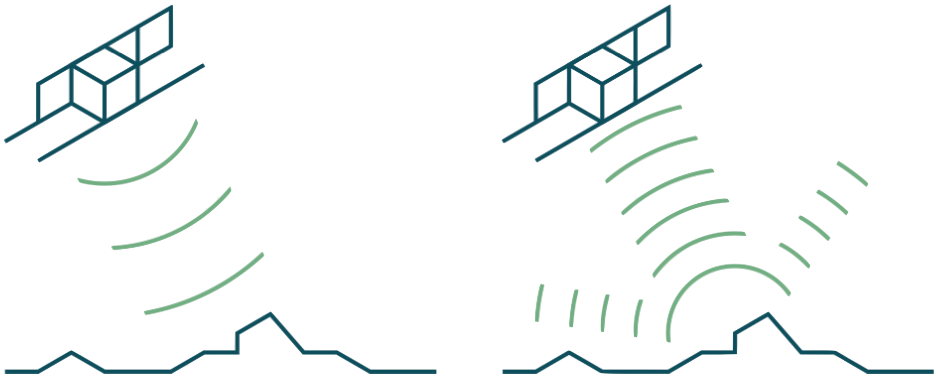
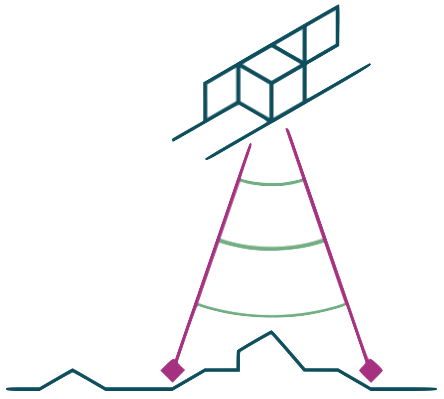
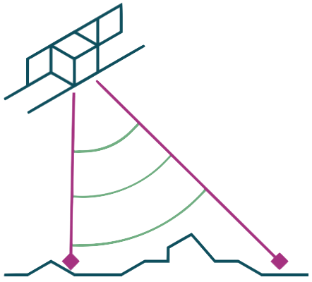
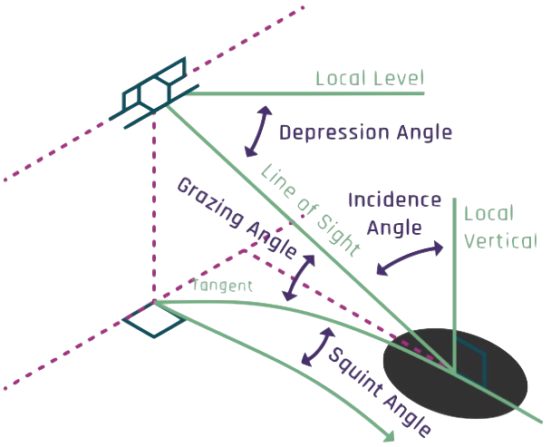
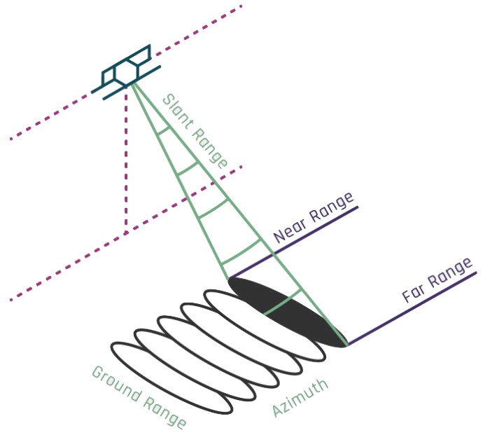
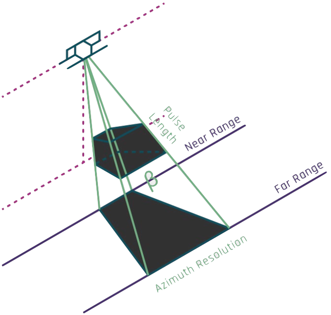

# A Simple Form of Radar Imaging
As seen in Figure 1 the radar antenna emits a series of pulses toward the ground where they are scattered in many directions. The sensor records the “backscatter”, which is the portion reflected toward the antenna. It measures the strength of the echo and the time it took for the pulse to travel to the ground and back.

<figure>

<figcaption align = "center"><em>Figure 1: Pulse Transmission and Backscatter</em></figcaption>
</figure>

Signal strength corresponds to pixel brightness and the timing provides range information. The range is one-half the total travel time. In the equation below, $\Delta T$ is the travel time and $c$ is the speed of light:

$$Range = \frac{\Delta T\ c}{2}$$

### Side-Looking Illumination
Since the pixels of a radar imaging system are placed on the image based partly on their range, the antenna cannot illuminate the ground in a vertical orientation. If it did, features on the same imaging line at equivalent angles off nadir would have identical ranges, like the two purple diamonds in Figure 2, and they would occupy the same pixel location.

<figure>

<figcaption align = "center"><em>Figure 2: Vertical Illumination</em></figcaption>
</figure>

Radar imaging must be side-looking so that ground points from the near to far range have different range values (Figure 3). The illumination is typically broadside, or perpendicular, to the flight direction. 

<figure>

<figcaption align = "center"><em>Figure 3: Side-Looking Illumination</em></figcaption>
</figure>

### Radar Angles
The angles associated with radar illumination are shown in Figure 4, which is based on a spherical earth surface. Most radar imaging is broadside to the flight direction, but some systems can collect off-broadside in a squinted orientation. The angle down from the local level at the sensor is called the depression angle. The angle between the line-of-sight ray and the local vertical is the incidence angle. The angle between the tangent to the surface and the line of sight is the grazing angle. Note that the incidence and grazing angles are complements in that they form a right angle when combined. This means that a 60° incidence angle is the same as a 30° grazing angle.

<figure>

<figcaption align = "center"><em>Figure 4: Radar Imaging Angles</em></figcaption>
</figure>

### Side Looking Airborne Radar
The first useful radar imaging technique was a form called Side-Looking Airborne Radar (SLAR) (Figure 5). The image is built up via the forward motion of the antenna, one line at a time. The pulses are emitted at a rate called the pulse repetition frequency (PRF), which can range from a few hundred pulses each second for airborne systems to thousands each second for spacecraft. In the SLAR technique, the individual pulses create each image line.
The angular width of the pulse on the ground along the direction of flight, or azimuth direction, determines one component of resolution. The range measurements are collected in the “slant range” direction, and range variations to different objects form the second dimension of resolution.

<figure>

<figcaption align = "center"><em>Figure 5: Side-Looking Airborne Radar</em></figcaption>
</figure>

SLAR was used the early days of radar imaging but it had serious limitations. Range resolution was one-half the length of the pulse in the range direction. Since the pulses are emitted at light speed, even a very brief pulse of one-millionth of a second would be 300 meters long and produce range resolution of 150 meters (Figure 6).

Azimuth resolution was based on the angular width of the pulse in the azimuth direction ($\beta$). Long antennas create narrow beams, but the beam spreads out from the antenna to the distant ground surface. Antennas cannot be made long enough to produce good azimuth resolution, and SLAR produced images with resolutions in the hundreds of meters, even from aircraft. This is why the brilliant concept of synthesizing a long antenna from the actions of a small one was developed. We call this Synthetic Aperture Radar.

<figure>

<figcaption align = "center"><em>Figure 6: SLAR Pulse Dimensions</em></figcaption>
</figure>
