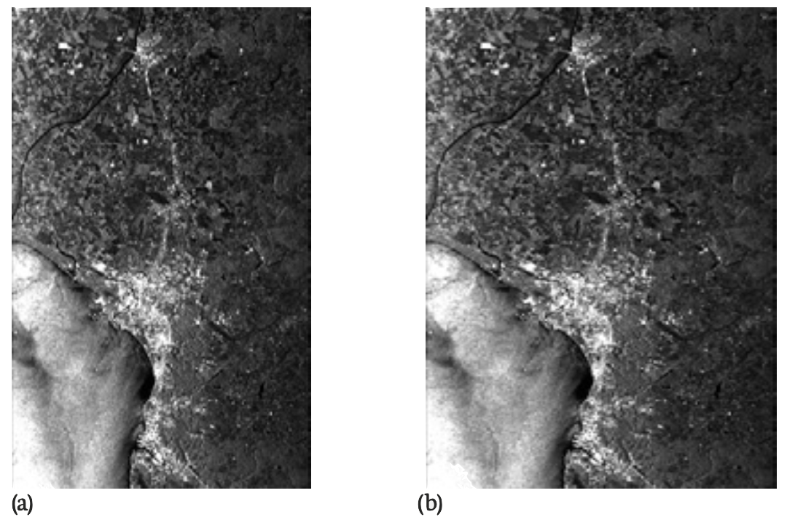

# PRODUCT FORMATS
## Geocoding Information in ICEYE Images
To enable easy and fast geolocation, a processed form of the geometry model called rational polynomial coefficients (RPCs) is provided for each image. RPCs link image locations to ground locations via simple equations that enable rapid calculations. In
addition to ease and speed, RPC coefficients have the further advantage of being sensor independent. The structure of the RPC equations is always the same. For this reason, RPC exploitation code does not have to change to accommodate different sensors. In fact, both optical and SAR sensors are modeled by the same RPC structure. Exploitation code that performs geolocation for images from optical sensors can actually be used to derive ground locations from the RPC data included with ICEYE complex and amplitude images. This process is now commonplace in most geospatial viewers (we recommend using QGIS[@qgis] and it is freely available for analysts and software developers.)

!!! info
    Image geolocation of any mono image, optical or SAR, requires that an elevation model be used during exploitation. This is true for the physics-based equations and RPCs. 

## Single Look Complex (SLC) Product
These are full-resolution, single-look images of the focused SAR signals. Scenes are stored in the satellite’s native image acquisition geometry, which is the slant-range-by-azimuth imaging plane. As shown in the green surface in Figure ??, the pixels are aligned perpendicular to the sensor flight track (The pixels have zero-Doppler SAR coordinates}). They are spaced equidistant in azimuth and in slant range. Each pixel contains both amplitude and phase information as represented by a complex magnitude value with *in-phase* and *quadrature* components (I & Q).

<figure markdown>
{width="100%"}
<figcaption align = "center"><em>Figure 2: Slant range and ground range image geometry</em></figcaption>
</figure>

SLC products are suitable for applications that rely on phase information or require the full image resolution. Because SLC images are in the native sensor orientation, there are no radiometric artefacts induced by the spatial resampling applied to map projection images. The range-azimuth orientation also enables further geometric manipulation, like orthorectification. Ortho versions can be produced using both commercial and free software tools, such as the European’s Space Agency’s Sentinel Application Platform (ESA SNAP S1TBX[@snap]).

The SLC product is particularly useful for those analysts who require multiple collections with matching phase data for applications like Coherent Change Detection (CCD). SLC images are typically used by scientists and organisations with advanced SAR expertise,
but complex images will become core products for numerous users once SAR
applications become more user-friendly.

## Amplitude Image
!!! note inline end
    When mapping an image from the slant plane to the ground, the average elevation of the scene is applied to the ellipsoid used in the projection.
These are viewable forms of SAR data used for analyst exploitation; the pixels have brightness values but no phase data. Amplitude images are multi-looked to reduce the salt-and-pepper effect of speckle. The images are also projected from the slant plane onto an ellipsoid model of the ground surface (See Figure 2). The resulting product has approximately square spatial resolution and equal pixel spacing. It also has reduced speckle, due to the multi-look processing. Figure 3 illustrates slant range and ground range projections of amplitude pixels. The pixel's dimensions are equal in range and azimuth in the ground projection on the right.

As with SLC images, sensor-oriented amplitude images maintain the native sensor geometry of range and azimuth and no image rotation to a map coordinate system has been performed. This avoids interpolation artefacts and it supports image stacking for change detection applications and physics-based, rigorous geolocation. ICEYE images can be viewed using open standard GIS readers such as QGIS[@qgis]. 

We do not orthorectify our amplitude images or project them to an ellipsoid-based map projection, but we provide information, which can be quickly applied by users to their ICEYE imagery using freeware software, available on the market. This lowers the cost to our customers and ensures that they are always aware of the provenance of the elevation data used to project the image pixels to the topographic surface. This software is described in our Imagery Product Format Specification Document[@level1doc].

<!-- ### General Compensated Phase History Data}
This is a data format that contains raw pulse information and all the required ancillary data to make a SAR image from an ICEYE collection. It is not an image product and it needs a SAR Image Formation Processor (IFP) to convert the GCPHD into an image. To assist in integrating our GCPHD format into your existing SAR IFP or, just to learn a bit more about how SAR signal processing works, we provide a very simple python-based SAR Processor with out GCPHD Documentation {\color{LIGHTPURPLE}\cite{}}. -->

<figure markdown>
{width="600"}
<figcaption align = "center"><em>Figure 3: Slant range and ground range images</em></figcaption>
</figure>

## ICEYE Image Formats
ICEYE SLC products are stored and delivered in the HDF5 format, which is particularly suitable for storing binary complex SAR data channels and annotated metadata. Amplitude images are produced as GeoTiff files. These are readable by common GIS software tools. Additionally, both SLC and Amplitude products are accompanied by XML metadata files. This enables quick screening of products without the use of specialized software.
A detailed description of the format of SLC data and amplitude images is given in the ICEYE Product Format Specification Document, which is available on the ICEYE website[@level1doc].

| | Complex | Amplitude | Quicklook |
|--|:--------:|:-----------:|:-----------:|
| Strip | HDF5,XML | GeoTiff,XML | PNG,KML |
| Spot | HDF5,XML | GeoTiff,XML | PNG,KML |
| Scan | - | GeoTiff,XML | PNG,KML|

## References
\bibliography
