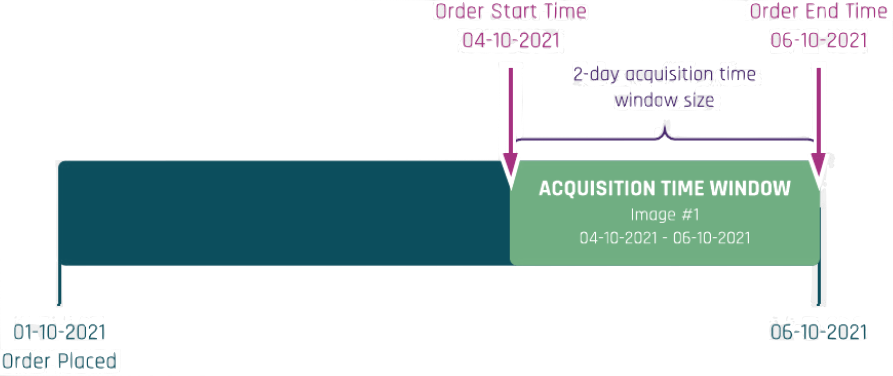
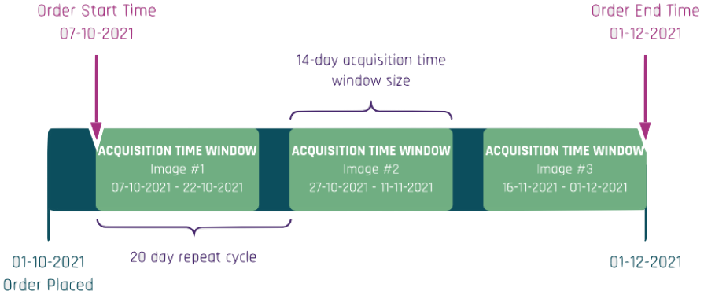
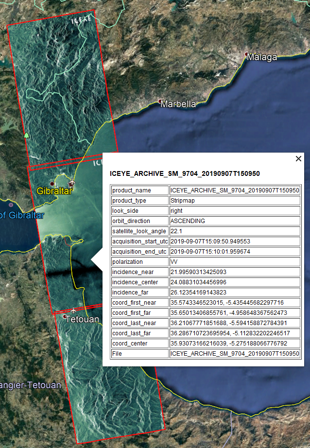

# Ordering ICEYE Products
ICEYE offers timely and reliable global SAR imaging. This section describes the tasking process for new ICEYE collections and how to order archived imagery from ICEYE’s catalog.

## ICEYE Tasking

To make things easier for customers we have a simple tasking process for new images based on standard imaging configurations and simple time windows (**Standard Orders**). This provides the quickest and simplest way to order SAR imagery. More sophisticated requests can be placed using a **Custom Order**. 

### Standard Orders
ICEYE Tasking Standard Orders are based on the concept of **acquisition time windows**. When placing an order, the customer specifies a list of timing requirements that define one or more time windows in which the desired images should be acquired.  This allows ICEYE to confirm that the images will be acquired during the specified time windows, **without** the need for the customer to review a preliminary feasibility study with exact acquisition times.

<figure markdown>
{width="600"}
<figcaption align = "center"><em>Figure 4: Example of a single image order with an <b>acquisition time window</b> of 2 days. This order specifies that the image should be collected anytime between 4-October-2021 00:00 and 6-October-2021 00:00</em></figcaption>
</figure>

<figure markdown>
{width="600"}
<figcaption align = "center"><em>Figure 5: Example of an order for a stack of images with a <b>repeat cycle</b> of 20 days and an <b>acquisition time window</b> for each image of 14 days.</em></figcaption>
</figure>

Standard orders are submitted via email. To order, please fill out the Standard Order Form with your contact information, and be sure to specify all the required tasking options described in the paragraphs below. Once completed, please send your Standard Order Form and the optional AOI file to the email address [customer@iceye.com](mailto:customer@iceye.com).
!!! info
    The order form will be provided by COSP. If you need a new one please email [customer@iceye.com](mailto:customer@iceye.com) 

<figure markdown>
{width="600"}
<figcaption align = "center"><em>Figure 6: Standard ICEYE Tasking order flow</em></figcaption>
</figure>

The named recipients for that order will be notified via email once the order is received by the ICEYE Customer Operations and Satellite Planning (COSP) team.

Once received, your order will be ingested into the ICEYE's planning system which will determine if the order can be confirmed within the AOI, and time windows that you have requested for the AOI. If the order can be fulfilled, you will be notified via email that your order has been accepted and the images will be scheduled for acquisition. If the order cannot be fulfilled in time, you will be notified via email that your order cannot be completed.

Please note that **standard** orders require no final confirmation from you. If your order is accepted, the images will be acquired and delivered to you.

After an order is confirmed, ICEYE will make sure that your images are acquired, downlinked, processed, quality controlled and delivered to you. The exact acquisition times are determined by the acquisition time window size that you chose when placing your order. 

#### How to fill in a standard order form

When placing a Standard Order you will need to specify and/or select from the following options available in the Imagery Order Form :

1. **AOI**: The Area of Interest in the form of a latitude/longitude pair in the WGS 84 coordinate system.  Alternatively, you can include a KML/KMZ, or geojson file as an attachment to your order.

2. **Timing information**:  

    * **Start and End time for the order**: This is the time range in which the order is valid. 
    * **Acquisition time windows size**: Choose a time window size according to the  precision that you require for each of the images that should be acquired.
        * Basic: Each image is acquired within a 14-day time window from your specified order start time and repeat cycle .This time window size is ideal for non-time-critical monitoring applications that do not require precise acquisition times.
        * Pro: Each image is acquired within a 2-day time window from your specified order start time and repeat cycle. This is our base level service, commonly used in applications that do not depend on exact acquisition times or geometries.
        * Exact: Each image is acquired within a 2-hour time window from your specified order start time and repeat cycle.  This is our premium service, tailored for time-critical collections that do not depend on the customer requiring a precise imaging geometry. Note that for Exact time window size, you can optionally include an attachment with your desired exact acquisition times. This attachment can be the result of a feasibility study that you had previously requested or it can be generated directly by you using our published satellite ephemerides. Please see the section Optional Feasibility Studies below. 
    * **Repeat cycle**: This is the time between the start of consecutive acquisition time windows. This information is only required for orders of image stacks (repeat acquisitions).

3. **Acquisition type**: Select whether you want a
    * Single acquisition of the specified AOI
    * Stack of images of the same AOI over a time period

4. **Imaging Mode**: Refer to Section~\ref{sec:TypesOfCollection} for more information on these imaging modes
    * Strip
    * Spot
    * Scan 

#### Feasibility Study as Part of a Standard Order

At any time, when considering placing an ICEYE Tasking standard order you can request a feasibility study by emailing [customer@iceye.com](mailto:customer@iceye.com). You will need to provide an AOI, an imaging mode (or resolution), a time period and any possible additional instructions that you may require. The ICEYE Customer Operations and Satellite Planning Team will respond with a list of acquisition opportunities. Please note that *Feasibility Studies* are for informational purposes and do not reserve constellation capacity for the opportunities reported. The required constellation capacity to fulfill an order under the agreed time window size is only reserved after ICEYE confirms an *order*. Please also note that feasibility studies are *not required* to place a standard order. You can eliminate the need for a feasibility study by accurately describing the time windows and other acquisition constraints that match your actual needs as part of your standard order.

<figure markdown>
{width="600"}
<figcaption align = "center"><em>Figure 7: Feasibility studies can be requested before placing a standard order.</em></figcaption>
</figure>

Sometimes you might like to perform your own feasibility studies and we encourage this. We have made sure our satellite ephemeris information is publicly available at <a href="http://www.celestrak.com" target="_blank">celestrak</a>[@celestrak] and <a href="https://www.n2yo.com" target="_blank">n2yo.com</a>[@n2yo], and have provided step by step instructions on how to use the Swath Acquisition Viewer Software, SaVoir on the <a href="https://www.iceye.com/sar-data/savoir" target="_blank">ICEYE website</a>. Let us know how well this works for you.

### Custom Orders

Custom Tasking orders offer a higher level of flexibility when specifying tasking requirements you desire. In general, any options that are not available as part of standard order can be requested as part of a custom order. 
Custom orders are initiated by submitting a Custom Order Form via email to [customer@iceye.com](mailto:customer@iceye.com). Our tasking experts will study the feasibility of your request and will quote an acquisition plan for you to approve.

The following are examples of options that are currently available as part of a custom order:

* **Mosaics** : Coverage of large areas by acquiring multiple images
* **Custom AOI coverage requirements** : Each acquired image must cover at least a minimum percentage of the area of interest.
* **Local time deviation limits** : Images belonging to a stack or mosaic collection should be acquired within a certain local time range. 
* **Long image size requirements** : Images that exceed the standard frame size of the requested imaging mode to cover the desired AOI. For example, long Strip acquisitions.
* **Azimuth angle deviation limits for stacks or mosaics** : Images belonging to a stack or mosaic collection should be acquired within a certain azimuth angle range.
* **Custom acquisition time windows not available as standard tasking options** : For example 72-hour, or 96-hour time windows for each acquisition.

Our tasking experts will be happy to try to accommodate any special tasking request that is required to meet your business needs.

<figure markdown>
{width="600"}
<figcaption align = "center"><em>Figure 8: Custom ICEYE Tasking order flow.</em></figcaption>
</figure>

## Quality Control and Image Delivery

The processed data will be assessed during the Quality Control process. An ICEYE image analyst will verify that the frame contains the customer’s target location, that it complies to the product specifications and that it does not contain any disqualifying ambiguities.

The frames are delivered to customers via a SFTP server within 8 hours of the data being acquired.  ICEYE offers faster delivery times for customers that require near-realtime data.  New customers receive instructions from the Customer Operations and Satellite Planning team on how to access your SFTP account. Through the SFTP server, you will have access to download all of your frames. You will receive a notification (via email) every time a new frame has been added to your SFTP account and is ready for you to download.

!!! info
    Images are stored in your SFTP account for a period of 30 days.

## Unforeseen Circumstances
In very rare situations, it might not be possible to acquire an image within the agreed time window. In this case, the Customer Operations and Satellite Planning team will immediately inform the customer and will propose an extended acquisition time window size or allow the customer to cancel the collection.

## ICEYE Archive Imagery
As an ICEYE customer, you have access to a complete catalog of archive imagery that is available for ordering. This catalog is updated on a regular basis on your SFTP account. The catalog is available in kmz and geojson formats and it includes low resolution image thumbnails so you can get a feel for the content of the image. The archive catalog can be viewed in Google Earth, QGIS or your favorite GIS where you can browse image locations, filter by time or different image metadata and perform advanced searches. Please note that imagery is included in the ICEYE Archive Catalog at least seven days after its acquisition time.

<figure markdown>
{width="600"}
<figcaption align = "center"><em>Figure 9: Browsing the ICEYE Archive catalog in Google Earth (kmz format).</em></figcaption>
</figure>

<figure markdown>
{width="600"}
<figcaption align = "center"><em>Figure 10: Browsing the ICEYE Archive catalog in QGIS (geojson format).</em></figcaption>
</figure>

Archive imagery orders can be submitted via email. To place an order, please fill out either the Standard Order Form or the Custom Order Form with your contact information, and include a list of the product names for the scenes that you wish to purchase. An example of a product name that identifies an image scene is :

    ICEYE_ARCHIVE_SM_10306_20190918T125047

Once an order is received, the ICEYE Customer Success team will deliver the requested images to you within 12 hours. Please note that all orders for archive imagery require no final confirmation from you. The images that you request in your order will be delivered to you. 

<figure markdown>
{width="600"}
<figcaption align = "center"><em>Figure 11: Archive imagery order flow.</em></figcaption>
</figure>

Please note that orders for archive imagery do not go through additional quality control. However, if you are not satisfied with the quality of an archive image that you have received, you can make use of our return policy described below.

## Order Cancellation

In order to support your evolving business requirements, ICEYE supports a user-friendly order cancellation policy.

### Cancellation of Tasking Orders

**Standard Tasking** orders confirmed by ICEYE can be cancelled free of charge up to 72 hours prior to the start of the acquisition time window.

**Custom Tasking** orders may be cancelled or rescheduled within twenty four (24) hours after order confirmation at no cost, as long as the order is submitted at least 27 hours before the proposed data collection time. 

Cancellation policy conditions are presented in the table below. 

<figure markdown>
| CANCELLATION REQUEST TIME (HOURS) | ADDITIONAL CONDITION | CANCELLATION CHARGE |
|-----------------------------------|----------------------|---------------------|
| Within 24 of order confirmation of a Custom Order | Order submitted >72h before the acquisition acquisition time window | Free of charge |
| More than 72h prior to the start of the acquisition time window | N/A | Free of charge |
| 72 - 48h prior to the start of the acquisition time window | N/A | 10% of the image value  |
| 48 - 24h prior to the start of the acquisition time window | N/A | 20% of the image value  |
| Less than 24h prior to the start of the acquisition time window | Order submitted >24h before the start of the acquisition time window | 100% of the image value |
<figcaption align = "center"><em>Table 2: Cancellation Requests.</em></figcaption>
</figure>

## Return Policy

If you are not satisfied with your purchase, please contact our Customer Operations and Satellite Planning team at [customer@iceye.com](mailto:customer@iceye.com) within 30 days of receiving your order. Your satisfaction is our priority, so we will work quickly to resolve your concerns. 
œ
## Invoicing

ICEYE users can pay for imaging in a range of different ways in order to be as flexible as possible:

* **Prepayment** : In this option a number of images can be paid for up-front. When the prepayment has been paid, you can place orders and receive the amount of data up to your prepaid quota. This is designed for customers that know that they would like to purchase a number of images and offers imagery at a reduced rate.
* **Net 30** : This is designed for larger or industrial customers wishing to purchase imagery in volume. In this case we will discuss your needs and enter into a contract with you. Images can then be tasked as and when you see fit and we will invoice you monthly. Payment then has to be made within 30 days of sending you the invoice.

ICEYE Finance will send invoices during the first week of the month for all the products delivered to the Customer within the previous month. The monthly invoice will not include the products that have been ordered but have not yet been delivered to the Customer. If no products have been shipped to the Customer during the previous month, invoice will not be extended.
