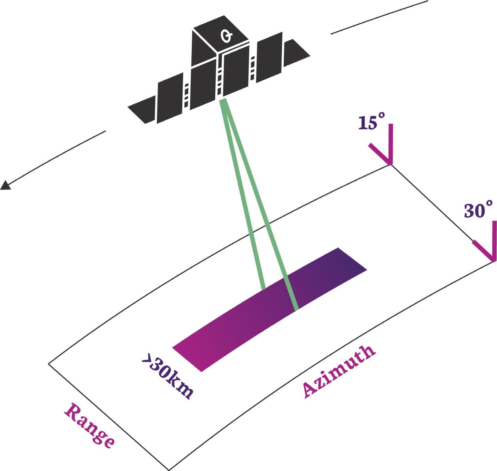

# ICEYE PRODUCTS

## Product Types
!!! info inline end

    The section "An Overview of SAR Imaging" provides a review of the technologies mentioned here. 

There are two basic forms of ICEYE images: *complex images* in the slant plane and *amplitude images* projected to the ground surface. Details about the formats of these products are provided in ['Product Formats'](#product-formats). 

### Complex Images

SAR complex images contain pixels that have both amplitude and phase values. They are produced at full resolution and are projected in the inclined direction of illumination, called the slant plane. Since complex images retain phase information, they can be used to produce numerous SAR products like coherent change detection images and precise surface motion measurements.

### Amplitude Images

These are the familiar SAR gray-scale images with amplitude-only pixels. They are “multi-looked” to reduce the grainy effect of speckle, at the cost of slightly lower resolution. Amplitude images are projected to the ground surface and can be oriented with respect to the sensor or produced on an ellipsoid-based map projection. For historical reasons our amplitude images are associated with the acronym *GRD* which stands for *Ground Range Detected*. This term may change in the future to be something more meaningful.

<!-- #### General Phase History Data Product
ICEYE also produces a basic form of SAR data that contains the raw pulse data before image processing. This data contains phase information as a function of time during the imaging operation and so it is called *phase history data*. This product enables more flexible processing for advanced users who might have their own SAR processor, or who might even prefer to exploit the data before converting it into an image.  -->

## Types of SAR Collection
Our first set of satellites operate in one of two primary imaging modes called Strip Mode and Spot Mode. These are available in both right and left-looking configurations. The design flexibility of our satellites allows their imaging modes to be continually evolved. We will be adding more modes, and more flexible illumination patterns, in future versions. A recent addition is the introduction of a wide area imaging capability that utilises electronic beam steering. This is called Scan Mode
A summary of the imaging modes is listed in [An Overview of SAR Imaging](/product-documentation/productguide/OverviewOfSAR/remarkableStory/#stripmap-and-spotlight-apertures).

### Strip Mode

{width="300" align=right}
In this mode the ground swath is illuminated with a continuous sequence of pulses while the antenna beam is fixed in its orientation. The beam is pointed off to the side of the satellite at an angle broadside to the satellite flight path. This results in a long image strip parallel to the flight direction.

ICEYE standard Strip products have a ground resolution of 3m in range and azimuth and cover an area of 30km (range) by 50km (azimuth). The strip length can be tailored up to a length of 500 km, in increments of 50 km.

### Spot Mode
{width="300" align=left}
In Spot mode the radar beam is steered to illuminate a fixed point. This increases the illumination time and therefore increases the length of the synthetic aperture and improves azimuth resolution. Spot mode uses the maximum 300 MHz pulse bandwidth to achieve a 0.5m slant range resolution ([here](/product-documentation/productguide/OverviewOfSAR/rangeResolution/#slant-range-resolution-examples) is an explanation of where this comes from.). 
</a>

ICEYE's standard Spot collection covers an area of 5km x 5km with a ground resolution of 1m and has 4 independent looks that are useful for suppressing speckle effects and increasing the image quality. Alternatively, customers can now request an *extended area* spot image. This is a standard Spot collection that trades the number of looks to increase the scene size whilst preserving the resolution. The *Spot extended area* collection has a scene size of 15km x 15km at 1m ground resolution using a single independent look.
</a>

### Scan Mode
{width="300" align=right}
This mode uses the phased array antenna to create multiple beams in the elevation direction. This beam steering means that points on the ground are not illuminated for as long which reduces the resolution of a Scan product compared to Spot or Strip modes. Conventionally, ground points are illuminated by different parts of the radar beam resulting in brighter and darker regions in the image. We compensate for this by also steering the radar beam sideways during each burst of radar pulses resulting in an overall improvement in image quality. This technique is called Terrain Observation by Progressive Scans (TOPS or TOPSAR[@TOPSAR]). Our Scan product produces imagery that covers an area of 100km x 100km with a resolution better than 15m. The length of a Scan product can be increased to 300km.</a>

<!-- % whilst performing adjacent Strip collections. While this produces much wider swath widths, it also lessens the collection time of ground points and degrades azimuth resolution. To help improve image quality we employ a technique called Terrain Observation by Progressive Scans (TOPS or TOPSAR \cite{TOPSAR}). We have two versions of our SCANSAR product, a four-beam image that covers 100km x 100km with a ground resolution of 12mx12m and a 2 beam product that covers 60km by 100km with a ground resolution of 6mx6m. The length of the image can be extended in azimuth up to 825km. -->

## References
\bibliography
